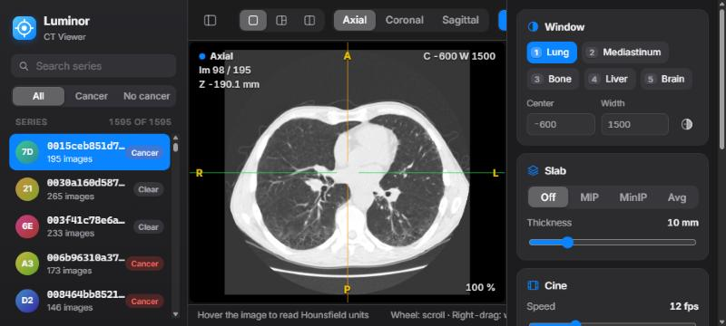

# Luminor

**An open-source CT viewer built around how radiologists actually read.**

Luminor puts the seven things a radiologist does all day at the tip of a key: scroll, window,
reformat, measure, project, compare and report. It runs entirely on your computer: a small
Python server reads the DICOM files, and a fast browser app does everything else.

**[Introduction](https://dhnguyends.github.io/luminor-dicom/)** ·
**[User guide](https://dhnguyends.github.io/luminor-dicom/guide.html)** ·
**[Guide utilisateur (français)](https://dhnguyends.github.io/luminor-dicom/guide-fr.html)**



> [!WARNING]
> **Research and education use only.** Luminor is not a certified medical device and must not
> be used for diagnostic or treatment decisions.
> If you want to use Luminor enhancement for medical use,
> let's talk linkedin.com/in/dong-hai-nguyen-thanh ↗

## The seven features

A radiologist reads 40 to 80 CT studies a day, and the same handful of actions make up nearly
all of that work. Luminor was designed from that routine.

| # | Feature | Why radiologists need it | In Luminor |
|---|---|---|---|
| 1 | **Scroll & cine** | Most reading time is spent scrolling through the stack, following structures from image to image. | Mouse wheel always scrolls (<kbd>Shift</kbd> ×5), arrow and page keys, cine at 2–40 images/s with <kbd>Space</kbd>, image number and position always shown. |
| 2 | **Window & level** | Every CT is read in lung, soft-tissue and bone windows; the window changes dozens of times per study. | Right-drag anywhere; presets on <kbd>1</kbd>–<kbd>5</kbd> (lung, mediastinum, bone, liver, brain; also on AZERTY); exact values; invert with <kbd>I</kbd>. |
| 3 | **MPR** | Findings are confirmed and located in coronal and sagittal planes. | Axial, coronal and sagittal panes with true proportions, a linked colour-coded crosshair and orientation letters from the DICOM tags. |
| 4 | **Measurements** | Nodule size drives follow-up; density tells cyst, fat, soft tissue or calcium apart. | Live HU probe, distances in mm from the true pixel spacing, ellipse ROI with mean ± SD, min/max and area. |
| 5 | **MIP & slabs** | MIP makes nodules stand out from vessels; MinIP shows airways and emphysema. | MIP, MinIP and average slabs from 2 to 40 mm in every plane (<kbd>T</kbd>, <kbd>+</kbd>/<kbd>−</kbd>). |
| 6 | **Comparison** | "New, stable or growing?" is the key question of every follow-up CT. | Two studies side by side, scrolling linked in millimetres, zoom and pan mirrored, one-key alignment (<kbd>K</kbd>). |
| 7 | **Findings & reports** | Every finding needs a name, a value and a location others can find again. | Named findings saved automatically, one-click navigation, Markdown report draft, annotated PNG key images. |

Press <kbd>?</kbd> in the app for every shortcut.

## Get started

Requires Python 3.10 or newer.

```bash
git clone https://github.com/dhnguyends/luminor-dicom.git
cd luminor-dicom
pip install -r requirements.txt
python server.py --data /path/to/series
```

Then open **http://127.0.0.1:8770/** in Chrome, Edge, Safari or Firefox.

| Option | Effect |
|---|---|
| `--data FOLDER` | Folder containing one sub-folder of `.dcm` files per CT series. |
| `--labels FILE.csv` | Optional `id,cancer` CSV, shown as labels and filters in the library. |
| `--port N` | Port to listen on (default 8770). |

On Windows, `start.ps1` starts the server and opens the browser
(`.\start.ps1 -DataDir "D:\scans" -Port 8770`). It uses an Anaconda environment named `DICOM`
when one exists.

**Sample data:** Luminor was developed with chest CT scans from the
[Kaggle Data Science Bowl 2017](https://www.kaggle.com/c/data-science-bowl-2017). The dataset is
not included: download it from the
[competition data page](https://www.kaggle.com/c/data-science-bowl-2017/data) (a Kaggle account
and acceptance of the [competition rules](https://www.kaggle.com/c/data-science-bowl-2017/rules)
are required), extract `stage1`, then run:

```bash
python server.py --data /path/to/stage1 --labels /path/to/stage1_labels.csv
```

## Documentation

| | English | Français |
|---|---|---|
| Introduction to the seven features | [index.html](https://dhnguyends.github.io/luminor-dicom/) | [index-fr.html](https://dhnguyends.github.io/luminor-dicom/index-fr.html) |
| User guide | [guide.html](https://dhnguyends.github.io/luminor-dicom/guide.html) | [guide-fr.html](https://dhnguyends.github.io/luminor-dicom/guide-fr.html) |

The guides cover every feature step by step, a suggested chest CT reading routine, an HU
reference table and troubleshooting. They live in [`docs/`](docs/), which is published with
GitHub Pages. While Luminor is running, they are also available at
`http://127.0.0.1:8770/guide.html` and from the shortcuts sheet in the app. Print a guide from
the browser to get a PDF.

## Languages

The interface is available in **English and French**. The globe button (**EN / FR**) in the
toolbar switches instantly. The choice is remembered, and the first launch follows the browser
language. French mode uses French conventions: UH, decimal commas, C/L window labels and
**D/G** orientation letters. All strings live in [`static/js/i18n.js`](static/js/i18n.js); to
add a language, add a dictionary there.

## Architecture

```
server.py               stdlib HTTP server (127.0.0.1 only) + pydicom/NumPy loader
static/index.html       app shell
static/style.css        design system (dark, translucent, Inter/SF typography)
static/js/volume.js     HU volume in the browser: planes, slabs, ROI statistics, orientation
static/js/viewport.js   canvas rendering, transforms, crosshair, overlays, HUD
static/js/app.js        state, layouts, tools, findings, comparison, cine, keyboard
static/js/i18n.js       English and French strings, locale-aware number formatting
docs/                   introduction pages and user guides (GitHub Pages)
data/findings/          saved findings, one JSON file per series (created at runtime)
```

The server reads a series once (sorted by slice position, converted to Hounsfield units per
slice) and sends it to the browser as a raw `int16` volume. Everything after that, including
window/level, reformats, slabs and statistics, is computed in the browser at interactive
speed. The last three volumes stay cached on the server. No build step and no JavaScript
dependencies.

### API

| Method | Path | Returns |
|---|---|---|
| GET | `/api/series` | catalog: id, slice count, label |
| GET | `/api/series/<id>/meta` | shape, spacing, z positions, orientation, HU range |
| GET | `/api/series/<id>/volume` | `int16` little-endian volume, C order (z, y, x) |
| GET / PUT | `/api/series/<id>/findings` | saved findings (JSON list) |

## Credits

- **Data:** the chest CT scans used to develop Luminor and shown in the documentation
  screenshots come from the
  [Kaggle Data Science Bowl 2017](https://www.kaggle.com/c/data-science-bowl-2017), hosted by
  [Kaggle](https://www.kaggle.com/). Many thanks to Kaggle and the competition organisers for
  making this anonymised dataset available to the research community. The data is not part of
  this repository and remains subject to the
  [competition rules](https://www.kaggle.com/c/data-science-bowl-2017/rules).
- **Libraries:** [pydicom](https://pydicom.github.io/) and [NumPy](https://numpy.org/) on the
  server; the browser app has no dependencies.
- **Typography:** [Inter](https://rsms.me/inter/) by Rasmus Andersson, served by Google Fonts.

## License

Luminor is released under the [Apache License 2.0](LICENSE). See [NOTICE](NOTICE) for
attribution. The license covers the source code and documentation, not the Kaggle data shown in
the screenshots.

## Privacy

The server listens on `127.0.0.1` only; images and findings never leave your computer. The only
outside request is for the Inter web font from Google Fonts; without internet, Luminor uses the
system font.
